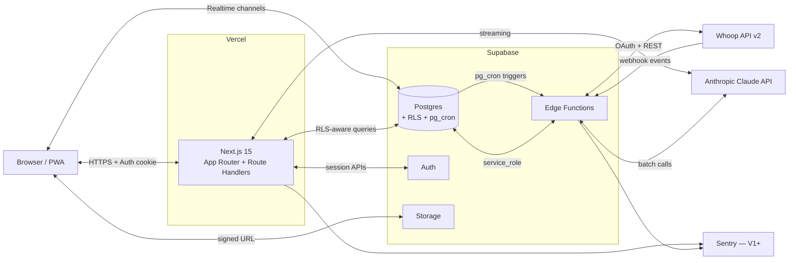

# 02 — Arquitectura

> Estado: ✅ Completo (sesión 3, 2026-05-08).

## Tabla de contenidos

1. [Resumen ejecutivo](#1-resumen-ejecutivo)
2. [Diagrama de alto nivel](#2-diagrama-de-alto-nivel)
3. [Componentes y dónde corre cada cosa](#3-componentes-y-dónde-corre-cada-cosa)
4. [Flujos detallados](#4-flujos-detallados)
5. [Fronteras de confianza](#5-fronteras-de-confianza)
6. [Estrategia de errores y reintentos](#6-estrategia-de-errores-y-reintentos)
7. [Edge cases conocidos](#7-edge-cases-conocidos)
8. [Decisiones cerradas en esta sesión](#8-decisiones-cerradas-en-esta-sesión)
9. [Decisiones abiertas](#9-decisiones-abiertas)

---

## 1. Resumen ejecutivo

Creed corre sobre tres servicios serverless gestionados:

- **Vercel** sirve la app Next.js (UI + API Routes).
- **Supabase Cloud** provee Postgres + Auth + Storage + Edge Functions con `pg_cron`.
- **Anthropic API** ejecuta los agentes; **Whoop API v2** entrega los datos del wearable.

No tenemos servidor propio. Todo el código de aplicación vive en un único monorepo con paquetes compartidos. La frontera de confianza dura está en Postgres con **RLS por usuario** (definida en `03-data-model.md`).

---

## 2. Diagrama de alto nivel

---

## 3. Componentes y dónde corre cada cosa

### 3.1 Resumen rápido

| Pieza | Dónde corre | Auth del cliente | Justificación |
|---|---|---|---|
| UI de la app (RSC + client components) | Next.js en Vercel (Edge runtime cuando aplique) | Sí (cookie de Supabase Auth) | Render rápido, SSR, RSC con datos del usuario |
| Conversación con coach (orquestador + agente) | **Next.js Route Handler** `/api/coach/*` | Sí | Necesita sesión, streaming SSE al cliente, mismo TS |
| Login / signup / magic link | Next.js Route Handlers `/auth/*` + Supabase Auth | Pre-auth | Sigue el patrón estándar `@supabase/ssr` |
| OAuth Whoop callback | Next.js Route Handler `/api/whoop/callback` | Sí (post-auth) | Cierre del flujo OAuth necesita sesión del usuario |
| Subir foto (progreso, comida) | Next.js Route Handler que devuelve **signed URL** de Storage; subida directa cliente → Storage | Sí | Evita stream de bytes por la app |
| Lectura de datos (dashboard, históricos) | RSC + cliente con Supabase JS (RLS) | Sí | RLS hace de seguridad por defecto |
| Sync de Whoop (polling cada 6h) | **Supabase Edge Function** `whoop-sync` + `pg_cron` | service_role | Sin sesión humana; trabajo de fondo |
| Webhook entrante de Whoop | **Supabase Edge Function** `whoop-webhook` | Pública (verifica firma) | Endpoint que Whoop llama desde fuera |
| Backfill al conectar Whoop | **Supabase Edge Function** `whoop-backfill` (one-shot) | service_role | Ejecución larga, no bloquea la UI |
| Recordatorio diario | **Supabase Edge Function** `daily-reminder` + `pg_cron` | service_role | Cron por timezone del usuario |
| Cierre semanal (cómputo + mensaje del coach) | **Supabase Edge Function** `weekly-close` + `pg_cron` | service_role | Trabajo asíncrono pesado, fuera del request del usuario |
| Compactación de conversaciones | **Supabase Edge Function** `compact-conversations` + `pg_cron` | service_role | Reduce coste de prompt; corre nocturno |
| Borrado de cuenta | **Supabase Edge Function** `account-deletion` | service_role | Necesita revocar Whoop, vaciar Storage, borrar filas |
| Observabilidad | Sentry SDK en Next.js + Edge Functions | n/a | Errores cliente y server |

### 3.2 Por qué esta separación

- **Next.js Route Handlers** para todo lo que tiene sesión humana en directo: streaming de respuesta, control de UI, autorización por usuario.
- **Edge Functions de Supabase** para todo lo que se ejecuta sin sesión: cron, webhooks externos, jobs largos. Tienen acceso a `service_role` (bypass RLS) por necesidad operativa, lo que justifica aislarlos del runtime del cliente.
- Ambos son serverless gestionados; cero servidores propios.

### 3.3 Paquetes del monorepo (recordatorio de `00-overview.md`)

- `apps/web` — la app Next.js completa.
- `packages/db` — tipos generados de Supabase + helpers de query.
- `packages/agents` — orquestador, nutricionista, preparador, prompts, definiciones de tools. Importado tanto desde `apps/web` como desde Edge Functions.
- `packages/integrations/whoop` — cliente OAuth + cliente REST + mapeos. Importado desde Edge Functions.
- `packages/ui` — componentes compartidos.
- `packages/i18n` — mensajes ES (y EN cuando se añada).

---

## 4. Flujos detallados

### 4.1 Onboarding y carpeta del atleta

1. Usuario se registra vía Supabase Auth (email + OTP, decisión final de método en `07-security-privacy.md`).
2. Trigger en `auth.users` crea fila vacía en `profiles` y en `athlete_folder` con `onboarding_status='pending'`.
3. Usuario accede al onboarding: una conversación dedicada (`conversations.mode='onboarding'`) con el orquestador en modo entrevista.
4. El agente recoge cobertura del cuestionario (`docs/01-product.md` §5.1) en pasos pequeños, escribiendo progresivamente en `athlete_folder` vía la tool `update_athlete_folder`.
5. Si el usuario abandona, el estado parcial queda guardado (`onboarding_status='in_progress'`); al volver el agente reanuda donde quedó.
6. Al cerrar el onboarding, el agente:
   - Marca `athlete_folder.initialized_at = now()` y `profiles.onboarding_status = 'complete'`.
   - Inserta en `agent_notes` un resumen del perfil ("baseline", `category='onboarding_summary'`).
7. Tras esto, el usuario ve el dashboard. Mientras Whoop no esté conectado, el dashboard muestra prompts para conectar.

### 4.2 Conectar Whoop

1. Usuario pulsa "Conectar Whoop" en el perfil.
2. Next.js Route Handler `/api/whoop/authorize` genera `state` y `code_verifier` (PKCE), los guarda en cookie HttpOnly y redirige al `authorize` de Whoop.
3. Tras autorizar, Whoop redirige a `/api/whoop/callback`.
4. Next.js intercambia `code` por `access_token` + `refresh_token`, los **cifra** y los inserta en `whoop_connections` (cifrado: decisión final pgsodium vs aplicación en sesión 4).
5. Insert en `audit_log` con `action='whoop_connect'`.
6. Next.js dispara la Edge Function `whoop-backfill` (vía RPC) para traer los últimos N días en background. La UI vuelve al dashboard mientras tanto.
7. El usuario ve los datos llenándose progresivamente vía Realtime.

### 4.3 Sync de Whoop — webhook (camino rápido)

1. Whoop envía un POST a `https://<project>.functions.supabase.co/whoop-webhook` con un evento (cycle_updated, sleep_updated, recovery_updated, workout_updated).
2. La Edge Function:
   - Verifica la firma HMAC con el secret de la app.
   - Resuelve `whoop_user_id → user_id` consultando `whoop_connections`.
   - Pide a Whoop el detalle del recurso afectado (no fiamos del payload del webhook como única fuente de verdad).
   - Hace `upsert` idempotente por `(user_id, whoop_id)` en la tabla correspondiente.
   - Actualiza `whoop_connections.last_synced_at`.
   - Publica un evento Realtime al canal del usuario (`channel: user:{id}`, evento `whoop:updated`) si hay alguien escuchando.
3. Si la verificación falla, devuelve 401 sin escribir nada.

### 4.4 Sync de Whoop — polling (red de seguridad)

1. `pg_cron` invoca la Edge Function `whoop-sync` cada 6 horas.
2. Por cada `whoop_connections` con `status='connected'`:
   - Si `expires_at` está cerca o pasado → refresh token; si falla → `status='expired'` y nota al usuario.
   - GET `/v2/cycle?start={last_synced_at}`, idem `/recovery`, `/sleep`, `/workout`.
   - `upsert` por `(user_id, whoop_id)` (mismo path que el webhook → idempotente).
   - Actualiza `last_synced_at`.
3. Una conexión que falla varias veces seguidas se marca `status='error'` y dispara una nota visible en el dashboard del usuario.

### 4.5 Conversación con un agente

1. UI envía POST `/api/coach/message` con `{ conversation_id, text }`. Si no hay `conversation_id`, se crea una nueva (`mode='normal'`).
2. Servidor:
   - Carga `athlete_folder` (1 row).
   - Carga las últimas N entradas relevantes (recovery 14d, peso 30d, comidas 7d, último entrenamiento) vía tools — pero **el contexto base** (folder + glosario + system prompt) se manda con `cache_control` para hit de **prompt caching**.
   - Carga el historial de la conversación: si hay `conversation_summary`, usa el summary + los últimos N turnos sin compactar; si no, usa los últimos N turnos directamente (umbral de N en sesión 5).
   - Llama al **orquestador** (Haiku, ver §3 de `05-agents.md`) con tool `route_to(agent)`.
   - Llama al agente seleccionado (Sonnet 4.6) con sus tools propias y stream activado.
   - El agente puede invocar tools que leen DB (read-only con RLS via JWT del usuario forwarded) y/o escriben (`write_agent_note`, `update_athlete_folder`, `propose_meal_plan`).
3. Stream se relay al cliente vía SSE.
4. Al finalizar:
   - Mensajes (user, tool calls, assistant) se persisten en `messages`.
   - Tool calls se persisten en `tool_calls` con duración y errores.
   - Notas escritas se persisten en `agent_notes`.
   - `conversations.last_message_at` se actualiza.

### 4.6 Recordatorio diario

1. `pg_cron` ejecuta `daily-reminder` cada hora (no podemos asumir una sola hora porque cada usuario tiene su `timezone`).
2. La función:
   - Selecciona usuarios cuya hora local sea igual a `profiles.notification_hour` y que **no** tengan ningún registro en el día (sin meals, sin body_measurements, sin training_sessions con status final, sin mensajes al coach).
   - Excluye los que ya tienen una fila en `daily_reminders_sent` para esa fecha.
   - Envía notificación por el canal preferido (`profiles.notification_channel`): PWA push si hay subscription registrada; email si no.
   - Inserta en `daily_reminders_sent` para anti-duplicado.

### 4.7 Cierre semanal

1. `pg_cron` ejecuta `weekly-close` cada hora con la misma lógica de timezone que el recordatorio.
2. Para cada usuario cuyo lunes 06:00 local cae en este tick:
   - Calcula los componentes del veredicto (peso EMA-7, recovery medio 14d, adherencia comidas/entrenamiento). Lógica en `packages/agents`.
   - Determina semáforo (verde/ámbar/rojo) según reglas de `01-product.md` §7.3.
   - Inserta `weekly_verdicts` (1 row).
   - Llama al **preparador** (Sonnet) en modo "weekly close" con el veredicto y datos de la semana → genera mensaje semanal.
   - Inserta el mensaje en `messages` con un nuevo `conversation` de modo `weekly_close`.
   - Si nutricionista debe ajustar (señal de adherencia o tendencia inesperada), se invoca también.

### 4.8 Re-engagement tras lapso

1. Cualquier carga de la app (RSC) computa `last_activity_at` del usuario (max de meals, body_measurements, training_sessions.done_at, messages user-side).
2. Si `now() - last_activity_at >= 3 días`:
   - El servidor marca un flag de UI "lapse_recovery_pending".
   - La UI redirige al chat con una conversación nueva `mode='lapse_recovery'`.
   - El primer mensaje lo manda el coach (preparador o nutricionista según última nota relevante) con el tono "ponme al día" (ver `01-product.md` §5.5).
3. Tras la respuesta del usuario, el agente extrae eventos a `agent_notes` (`category='lapse_summary'`) y reajusta plan si procede.
4. Cuando el usuario sale del flow, la UI vuelve al dashboard normal.

### 4.9 Borrado de cuenta

1. Usuario acciona "Borrar cuenta" en perfil → confirma.
2. Next.js marca `profiles.deletion_requested_at` y dispara `account-deletion`.
3. Edge Function:
   - Revoca el OAuth de Whoop (`POST /v2/oauth/revoke`) si hay conexión activa.
   - Borra recursivamente objetos en Storage bajo el prefijo `user/{id}/`.
   - Inserta en `audit_log` con `action='account_deleted'`.
   - Ejecuta `delete from auth.users where id = $1` — la cascada de FKs vacía todo lo demás.
4. Cierra sesión y muestra confirmación.

---

## 5. Fronteras de confianza

### 5.1 Qué se queda en Postgres y nunca sale

- Tokens de Whoop (cifrados).
- Cookies de sesión.
- Audit log.
- Datos raw completos de Whoop (`raw jsonb`) — para futuro-proofing y reprocesado.

### 5.2 Qué sale a Anthropic

Solo el **mínimo necesario** para la respuesta del agente:

- System prompt + glosario (cacheable).
- `athlete_folder` actual del usuario (cacheable; pseudonimizamos: `display_name` se envía como tal porque ayuda al tono, pero no enviamos email, ni teléfono, ni dirección — el modelo no necesita identidad legal).
- Datos recientes que el agente pide vía tools (recovery 14d, peso 30d, comidas 7d, etc.).
- Historial reciente de la conversación + summary si existe.

**Nunca enviamos** a Anthropic:
- Tokens de Whoop ni cookies.
- Email del usuario.
- Datos raw completos de Whoop (solo derivados).
- Imágenes (Storage no se manda al modelo en MVP).
- Datos de otros usuarios.

### 5.3 Qué sale a Whoop

- OAuth standard (authorize/callback, refresh).
- GETs a sus endpoints REST con el bearer token del usuario.
- Nada de datos del atleta van **hacia** Whoop (es lectura unidireccional).

### 5.4 Qué sale a Vercel

- Logs de la app (sin contenido de mensajes en logs por defecto — solo metadata: conversation_id, duration, tokens).
- Tráfico HTTPS.

### 5.5 Qué sale a Sentry

- Trazas de error con stack trace.
- Sin datos de mensajes ni de biometría: filtramos en el SDK con `beforeSend`.

---

## 6. Estrategia de errores y reintentos

### 6.1 Sync de Whoop fallido

- 401 → intentar refresh, reintentar 1 vez, si vuelve a fallar → marcar conexión `expired` y notificar al usuario.
- 429 → backoff exponencial empezando en 30s, hasta 3 reintentos.
- 5xx → reintentar 3 veces con jitter; si persiste, registrar en `audit_log` y reintentar en el siguiente tick de cron.
- Token revocado por el usuario en Whoop → 401 sostenido → `status='revoked'`, no se intenta refresh.

### 6.2 Anthropic

- 429 / overloaded → reintento con jitter (3 intentos máx, 1s/3s/8s).
- 5xx → mismo patrón.
- Streaming corrupto a mitad → si tenemos tokens parciales, se persisten como mensaje incompleto con `status='partial'` y la UI muestra "respuesta interrumpida".
- Tool call que devuelve error → el agente recibe el error y decide si reintenta o continúa con la información disponible.

### 6.3 Postgres

- Connection error desde Edge Function → reintento simple (1 vez).
- Insert que viola constraint → log y descarta (no es de sistema; es de datos).

### 6.4 Webhooks

- Si la verificación de firma falla → 401 silencioso (no decimos por qué).
- Si el evento se procesó hace < 60s (idempotencia por `whoop_id` + timestamp) → 200 OK sin re-procesar.

---

## 7. Edge cases conocidos

- **Cycle parcial**: Whoop devuelve `cycle` con `end_at = null` mientras el día sigue abierto. La fila se inserta con `end_at = null` y se actualiza al cierre.
- **Cambio de timezone del usuario**: si actualiza `profiles.timezone`, los crons de recordatorio y cierre semanal toman el nuevo valor en el siguiente tick. No hay rebackfill.
- **Reloj saltando hacia atrás (DST)**: aceptamos un recordatorio duplicado en el primer día del cambio, pero el `unique(user_id, reminder_date)` lo descarta.
- **Backfill colisiona con webhook**: ambos hacen `upsert` idempotente; el último que llega gana, pero no hay duplicación.
- **Conversación que supera ventana**: cuando supera el umbral, el cron `compact-conversations` genera summary nocturno; mientras, el flujo sigue funcionando con todos los turnos hasta que la compactación corre.
- **Usuario borra cuenta a mitad de un sync**: la cascada del DELETE invalida la fila; la Edge Function en curso recibe error y aborta limpiamente.
- **Whoop deja de enviar webhooks**: el polling de cada 6h cubre el hueco. Si pasa > 24h sin sync, el dashboard avisa al usuario.

---

## 8. Decisiones cerradas en esta sesión

> Sesión 3, fecha 2026-05-08.

- **Orquestación de agentes en Next.js Route Handler**, no en Edge Function. Streaming + sesión + monorepo TS.
- **Edge Functions de Supabase para cron, webhooks, jobs largos** (sync Whoop polling, webhook Whoop, daily-reminder, weekly-close, compact-conversations, account-deletion).
- **Sync de Whoop hybrid**: webhook (rápido) + polling cada 6h (red de seguridad). Misma ruta de upsert idempotente.
- **Compactación de conversaciones**: resumen LLM con Haiku 4.5 cuando supera N turnos (umbral exacto se cierra en sesión 5).
- **Carga inicial de Whoop**: backfill ejecutado en Edge Function después del callback OAuth (cantidad exacta de días en sesión 4).
- **`pg_cron` como scheduler**, no GitHub Actions ni cron externo: vive con la DB y usa el mismo modelo de auth.
- **Prompt caching** habilitado para system prompt + `athlete_folder` + glosario en cada llamada al agente.
- **Realtime** habilitado para empujar updates de Whoop al dashboard cuando el usuario está online.

## 9. Decisiones abiertas

| Pregunta | Sesión que la cierra |
|---|---|
| Cifrado de tokens Whoop: pgsodium vs aplicación | 4 (whoop) |
| Cantidad de días de backfill al conectar | 4 (whoop) |
| Modelo del orquestador (Haiku con tool vs clasificador determinista) | 5 (agentes) |
| Umbral exacto de turnos antes de compactar conversación | 5 (agentes) |
| Canal final del recordatorio (PWA push vs email) | 6 (frontend) + 8 (deployment) |
| Estrategia de signed URLs para Storage (TTL, scope) | 6 (frontend) |
