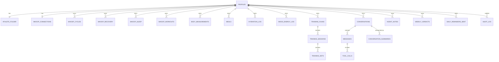

# 03 — Modelo de datos

> Estado: ✅ Completo (sesión 3, 2026-05-08).

## Tabla de contenidos

1. [Principios del modelo](#1-principios-del-modelo)
2. [Convenciones](#2-convenciones)
3. [Diagrama ER](#3-diagrama-er)
4. [Identidad y perfil](#4-identidad-y-perfil)
5. [Wearables — Whoop](#5-wearables--whoop)
6. [Datos manuales del atleta](#6-datos-manuales-del-atleta)
7. [Entrenamiento](#7-entrenamiento)
8. [Agentes y conversaciones](#8-agentes-y-conversaciones)
9. [Operacional](#9-operacional)
10. [Multimedia (Storage)](#10-multimedia-storage)
11. [RLS por tabla](#11-rls-por-tabla)
12. [Índices](#12-índices)
13. [Migraciones](#13-migraciones)
14. [Retención y borrado](#14-retención-y-borrado)
15. [Decisiones cerradas en esta sesión](#15-decisiones-cerradas-en-esta-sesión)
16. [Decisiones abiertas](#16-decisiones-abiertas)

---

## 1. Principios del modelo

- **Inmutabilidad razonable**: los registros del atleta (comidas, peso, entrenamientos) son **inmutables tras un período de gracia corto**. La corrección posterior se hace por nueva fila o por update con `updated_at` y `user_corrected=true`. Nunca borramos registros antiguos para "rehacerlos".
- **Time series con índices descendentes**: las queries del dashboard piden "los últimos N días"; los índices se diseñan para eso.
- **JSONB solo cuando la forma es genuinamente variable**: payloads raw de Whoop, parsing de comidas, restricciones del atleta. Para los demás campos, columnas tipadas.
- **Aislamiento por usuario en cada tabla**: toda fila pertenece a un único `user_id`; RLS lo enforza.
- **Service role limitado a Edge Functions**: nunca expuesto al cliente.
- **Cifrado a nivel columna** para tokens de Whoop. Estrategia exacta en `04-whoop-integration.md`.

---

## 2. Convenciones

- `id uuid primary key default gen_random_uuid()` salvo claves naturales (`profiles.id` referencia `auth.users.id`).
- `user_id uuid not null references profiles(id) on delete cascade` en cada tabla "del atleta", incluso cuando es derivable por joins. La denormalización ayuda al RLS y al particionado futuro.
- `created_at timestamptz not null default now()` siempre.
- `updated_at timestamptz not null default now()` con trigger `set_updated_at()` para tablas que mutan.
- Tipos:
  - Texto → `text` (no `varchar(n)` salvo cuando hay un límite real).
  - Números biométricos → `numeric(precision, scale)` con la escala mínima razonable.
  - Fechas → `date` para días naturales; `timestamptz` para instantes.
- Enumeraciones → `text` con `check (value in (…))`. Postgres ENUM solo si el set es muy estable.
- Soft delete (`deleted_at`) solo donde haga falta. Por defecto, hard delete con cascada.

---

## 3. Diagrama ER



---

## 4. Identidad y perfil

### 4.1 `profiles`

Extiende `auth.users` (gestionado por Supabase Auth) con metadata de aplicación.

```sql
create table profiles (
  id                      uuid primary key references auth.users(id) on delete cascade,
  display_name            text not null,
  timezone                text not null default 'Europe/Madrid',
  locale                  text not null default 'es' check (locale in ('es','en')),
  sex                     text check (sex in ('male','female','other')),
  date_of_birth           date,
  height_cm               numeric(5,1) check (height_cm > 0),
  notification_channel    text not null default 'email'
                           check (notification_channel in ('push','email','none')),
  notification_hour       smallint not null default 21
                           check (notification_hour between 0 and 23),
  push_endpoint           jsonb,            -- VAPID subscription cuando hay PWA push
  onboarding_status       text not null default 'pending'
                           check (onboarding_status in ('pending','in_progress','complete')),
  role                    text not null default 'athlete'
                           check (role in ('athlete','admin')),  -- añadido en sesión 5
  deletion_requested_at   timestamptz,
  created_at              timestamptz not null default now(),
  updated_at              timestamptz not null default now()
);
```

Trigger automático: cuando se crea una fila en `auth.users`, se inserta una `profiles` con `display_name = email` (placeholder editable) y una `athlete_folder` vacía.

### 4.2 `athlete_folder`

Memoria persistente del atleta. Ambos agentes la leen en cada turno; la escriben mediante la tool `update_athlete_folder` y siempre dejan trazo en `agent_notes`.

```sql
create table athlete_folder (
  user_id                 uuid primary key references profiles(id) on delete cascade,
  primary_objective       text check (primary_objective in
                           ('lose_fat','build_muscle','build_strength','recomp','maintain')),
  secondary_objectives    text[] not null default '{}',
  baseline_weight_kg      numeric(5,2),
  baseline_body_fat_pct   numeric(4,1),
  target_weight_kg        numeric(5,2),
  target_date             date,
  restrictions            jsonb not null default '{}'::jsonb,
  -- restrictions schema (sin contrato de DB, solo convención):
  --   { injuries: [{body_part, severity, since, notes}],
  --     allergies: [string], intolerances: [string], dislikes: [string] }
  equipment               jsonb not null default '{}'::jsonb,
  -- equipment schema: { gym: bool, home: [string], notes: text }
  schedule                jsonb not null default '{}'::jsonb,
  -- schedule schema: { training_days: [iso_dow], meal_window: {from, to} }
  notes_summary           text,
  version                 integer not null default 1,
  initialized_at          timestamptz,
  updated_at              timestamptz not null default now()
);
```

Cada actualización incrementa `version` (vía trigger). El histórico de versiones no se guarda como tal en MVP; la trazabilidad de cambios vive en `agent_notes`. (Si quisiéramos auditar versiones completas, en V1 añadimos `athlete_folder_history`.)

---

## 5. Wearables — Whoop

### 5.1 `whoop_connections`

```sql
create table whoop_connections (
  user_id                 uuid primary key references profiles(id) on delete cascade,
  whoop_user_id           text not null unique,
  access_token_encrypted  bytea not null,
  refresh_token_encrypted bytea not null,
  expires_at              timestamptz not null,
  scopes                  text[] not null,
  status                  text not null default 'connected'
                           check (status in ('connected','expired','revoked','error')),
  last_synced_at          timestamptz,
  last_error              text,
  connected_at            timestamptz not null default now()
);
```

### 5.2 `whoop_cycles`

```sql
create table whoop_cycles (
  id          uuid primary key default gen_random_uuid(),
  user_id     uuid not null references profiles(id) on delete cascade,
  whoop_id    bigint not null,
  start_at    timestamptz not null,
  end_at      timestamptz,                       -- null mientras el ciclo sigue abierto
  strain      numeric(4,2) check (strain between 0 and 21),
  avg_hr      smallint,
  max_hr      smallint,
  raw         jsonb not null,                    -- payload completo de Whoop
  synced_at   timestamptz not null default now(),
  unique (user_id, whoop_id)
);
```

### 5.3 `whoop_recovery`

```sql
create table whoop_recovery (
  id                       uuid primary key default gen_random_uuid(),
  user_id                  uuid not null references profiles(id) on delete cascade,
  cycle_whoop_id           bigint not null,
  date                     date not null,
  score                    smallint check (score between 0 and 100),
  resting_heart_rate       smallint,
  hrv_rmssd_milli          numeric(6,2),
  spo2_pct                 numeric(4,1),
  skin_temp_celsius        numeric(4,2),
  raw                      jsonb not null,
  synced_at                timestamptz not null default now(),
  unique (user_id, cycle_whoop_id)
);
```

### 5.4 `whoop_sleep`

```sql
create table whoop_sleep (
  id                          uuid primary key default gen_random_uuid(),
  user_id                     uuid not null references profiles(id) on delete cascade,
  whoop_id                    bigint not null,
  start_at                    timestamptz not null,
  end_at                      timestamptz not null,
  duration_in_bed_minutes     integer,
  sleep_minutes               integer,
  rem_minutes                 integer,
  deep_minutes                integer,
  light_minutes               integer,
  awake_minutes               integer,
  efficiency_pct              numeric(4,1),
  needed_minutes              integer,
  is_nap                      boolean default false,
  raw                         jsonb not null,
  synced_at                   timestamptz not null default now(),
  unique (user_id, whoop_id)
);
```

### 5.5 `whoop_workouts`

```sql
create table whoop_workouts (
  id              uuid primary key default gen_random_uuid(),
  user_id         uuid not null references profiles(id) on delete cascade,
  whoop_id        bigint not null,
  sport           text,
  start_at        timestamptz not null,
  end_at          timestamptz not null,
  strain          numeric(4,2),
  avg_hr          smallint,
  max_hr          smallint,
  kilojoule       numeric(8,2),
  distance_meters numeric(8,1),
  raw             jsonb not null,
  synced_at       timestamptz not null default now(),
  unique (user_id, whoop_id)
);
```

---

## 6. Datos manuales del atleta

### 6.1 `body_measurements`

```sql
create table body_measurements (
  id              uuid primary key default gen_random_uuid(),
  user_id         uuid not null references profiles(id) on delete cascade,
  measured_at     timestamptz not null,
  weight_kg       numeric(5,2) check (weight_kg > 0),
  body_fat_pct    numeric(4,1) check (body_fat_pct between 0 and 70),
  waist_cm        numeric(5,1),
  hip_cm          numeric(5,1),
  chest_cm        numeric(5,1),
  arm_cm          numeric(5,1),
  thigh_cm        numeric(5,1),
  notes           text,
  created_at      timestamptz not null default now()
);
```

### 6.2 `meals`

Texto libre del atleta + parsing por Haiku 4.5. Las macros denormalizadas permiten agregaciones rápidas.

```sql
create table meals (
  id                  uuid primary key default gen_random_uuid(),
  user_id             uuid not null references profiles(id) on delete cascade,
  consumed_at         timestamptz not null,
  meal_type           text check (meal_type in
                       ('breakfast','lunch','dinner','snack','other')),
  raw_text            text not null,            -- input del usuario
  parsed              jsonb,                    -- estructura del parser
  -- parsed schema (convención):
  --   { items: [{name, quantity, unit, calories, protein_g, carbs_g, fat_g}],
  --     warnings: [string] }
  total_calories      integer,
  total_protein_g     numeric(5,1),
  total_carbs_g       numeric(5,1),
  total_fat_g         numeric(5,1),
  parser_confidence   numeric(3,2) check (parser_confidence between 0 and 1),
  parser_version      text,
  user_corrected      boolean not null default false,
  photo_path          text,                     -- ref a Storage (V1)
  created_at          timestamptz not null default now(),
  updated_at          timestamptz not null default now()
);
```

### 6.3 `hydration_log`

```sql
create table hydration_log (
  id          uuid primary key default gen_random_uuid(),
  user_id     uuid not null references profiles(id) on delete cascade,
  logged_at   timestamptz not null,
  amount_ml   integer not null check (amount_ml > 0),
  source      text not null default 'water'
               check (source in ('water','coffee','tea','sports_drink','other')),
  created_at  timestamptz not null default now()
);
```

### 6.4 `mood_energy_log`

```sql
create table mood_energy_log (
  id          uuid primary key default gen_random_uuid(),
  user_id     uuid not null references profiles(id) on delete cascade,
  logged_at   timestamptz not null,
  mood        smallint check (mood between 1 and 5),
  energy      smallint check (energy between 1 and 5),
  notes       text,
  created_at  timestamptz not null default now()
);
```

---

## 7. Entrenamiento

### 7.1 `training_plans`

```sql
create table training_plans (
  id                  uuid primary key default gen_random_uuid(),
  user_id             uuid not null references profiles(id) on delete cascade,
  week_start          date not null,
  goal                text,
  rationale           text,
  generated_by        text not null default 'trainer_agent'
                       check (generated_by in ('trainer_agent','manual')),
  generator_version   text,
  status              text not null default 'active'
                       check (status in ('draft','active','superseded','archived')),
  created_at          timestamptz not null default now(),
  unique (user_id, week_start, status)            -- evita dos activos en la misma semana
);
```

### 7.2 `training_sessions`

```sql
create table training_sessions (
  id              uuid primary key default gen_random_uuid(),
  plan_id         uuid not null references training_plans(id) on delete cascade,
  user_id         uuid not null references profiles(id) on delete cascade,
  scheduled_for   date not null,
  type            text,                          -- 'push','pull','legs','full','cardio','rest',…
  prescribed      jsonb not null,                -- ejercicios con sets/reps/intensidad
  -- prescribed schema:
  --   { blocks: [{name, exercises: [{name, sets, reps, rpe, rest_s, notes}]}] }
  status          text not null default 'scheduled'
                   check (status in ('scheduled','done','skipped','partial')),
  done_at         timestamptz,
  rpe             smallint check (rpe between 1 and 10),
  notes           text,
  created_at      timestamptz not null default now(),
  updated_at      timestamptz not null default now()
);
```

### 7.3 `training_sets` (V1, opcional en MVP)

```sql
create table training_sets (
  id            uuid primary key default gen_random_uuid(),
  session_id    uuid not null references training_sessions(id) on delete cascade,
  user_id       uuid not null references profiles(id) on delete cascade,
  exercise      text not null,
  set_number    smallint not null check (set_number > 0),
  reps          smallint check (reps > 0),
  weight_kg     numeric(6,2),
  rpe           smallint check (rpe between 1 and 10),
  is_warmup     boolean not null default false,
  notes         text,
  performed_at  timestamptz not null default now(),
  created_at    timestamptz not null default now()
);
```

---

## 8. Agentes y conversaciones

### 8.1 `conversations`

```sql
create table conversations (
  id                uuid primary key default gen_random_uuid(),
  user_id           uuid not null references profiles(id) on delete cascade,
  title             text,
  agent_role        text check (agent_role in
                     ('nutrition','training','general','mixed')),
  mode              text not null default 'normal'
                     check (mode in
                       ('normal','onboarding','lapse_recovery','weekly_close')),
  status            text not null default 'active'
                     check (status in ('active','closed','archived')),
  last_message_at   timestamptz not null default now(),
  created_at        timestamptz not null default now()
);
```

### 8.2 `messages`

Cada turno es una fila. `role='user'` y `role='assistant'` son los del usuario y el modelo. `role='tool'` registra resultados de tool calls reinyectados al modelo.

```sql
create table messages (
  id                       uuid primary key default gen_random_uuid(),
  conversation_id          uuid not null references conversations(id) on delete cascade,
  user_id                  uuid not null references profiles(id) on delete cascade,
  turn                     smallint not null,
  role                     text not null
                            check (role in ('user','assistant','system','tool')),
  agent                    text check (agent in
                            ('nutritionist','trainer','orchestrator')),
  content                  text,
  tool_calls               jsonb,                -- cuando el assistant llama a tools
  tool_call_id             text,                 -- cuando role=tool
  model                    text,                 -- 'claude-sonnet-4-6' / 'claude-haiku-4-5-…'
  input_tokens             integer,
  output_tokens            integer,
  cache_read_tokens        integer,
  cache_creation_tokens    integer,
  status                   text not null default 'complete'
                            check (status in ('complete','partial','error')),
  created_at               timestamptz not null default now(),
  unique (conversation_id, turn)
);
```

### 8.3 `conversation_summaries`

Compactación nocturna por Haiku para no reenviar todo el historial cada turno.

```sql
create table conversation_summaries (
  id                    uuid primary key default gen_random_uuid(),
  conversation_id       uuid not null references conversations(id) on delete cascade,
  user_id               uuid not null references profiles(id) on delete cascade,
  up_to_turn            smallint not null,        -- summary cubre turns 1..up_to_turn
  summary               text not null,
  generated_by_model    text not null,
  created_at            timestamptz not null default now(),
  unique (conversation_id, up_to_turn)
);
```

### 8.4 `agent_notes`

Memoria estructurada compartida entre los dos agentes (siempre del mismo atleta, nunca cruzada).

```sql
create table agent_notes (
  id                uuid primary key default gen_random_uuid(),
  user_id           uuid not null references profiles(id) on delete cascade,
  agent             text not null check (agent in
                     ('nutritionist','trainer','orchestrator','system')),
  category          text not null,
  -- ejemplos: 'plan_change','observation','red_flag','recovery_low',
  --           'lapse_summary','onboarding_summary','adherence_drop'
  body              text not null,
  signal            jsonb,                        -- datos que dispararon la nota
  conversation_id   uuid references conversations(id) on delete set null,
  message_id        uuid references messages(id) on delete set null,
  created_at        timestamptz not null default now()
);
```

### 8.5 `tool_calls`

Trazabilidad de cada invocación de tool por parte del agente.

```sql
create table tool_calls (
  id                uuid primary key default gen_random_uuid(),
  user_id           uuid not null references profiles(id) on delete cascade,
  conversation_id   uuid references conversations(id) on delete set null,
  message_id        uuid not null references messages(id) on delete cascade,
  tool_name         text not null,
  arguments         jsonb not null,
  result            jsonb,
  error             text,
  duration_ms       integer,
  created_at        timestamptz not null default now()
);
```

---

## 9. Operacional

### 9.1 `daily_reminders_sent`

Anti-duplicado del recordatorio diario.

```sql
create table daily_reminders_sent (
  id              uuid primary key default gen_random_uuid(),
  user_id         uuid not null references profiles(id) on delete cascade,
  reminder_date   date not null,
  channel         text not null check (channel in ('push','email')),
  sent_at         timestamptz not null default now(),
  unique (user_id, reminder_date)
);
```

### 9.2 `weekly_verdicts`

Output del cierre semanal. La UI lo lee para mostrar el semáforo.

```sql
create table weekly_verdicts (
  id              uuid primary key default gen_random_uuid(),
  user_id         uuid not null references profiles(id) on delete cascade,
  week_start      date not null,
  status          text not null check (status in ('green','amber','red')),
  components      jsonb not null,
  -- components schema:
  --   { weight_trend: {direction, slope_kg_per_week, ema7_kg},
  --     recovery_avg_14d: number,
  --     adherence_meals_pct: number,
  --     adherence_training_pct: number,
  --     mood_avg: number | null }
  coach_message   text,
  created_at      timestamptz not null default now(),
  unique (user_id, week_start)
);
```

### 9.3 `audit_log`

Eventos sensibles que queremos poder auditar fuera del flujo normal.

```sql
create table audit_log (
  id           uuid primary key default gen_random_uuid(),
  user_id      uuid references profiles(id) on delete set null,
  action       text not null,
  -- ejemplos: 'whoop_connect','whoop_disconnect','account_deletion_requested',
  --           'account_deleted','password_changed','export_requested'
  metadata     jsonb,
  ip           inet,
  user_agent   text,
  created_at   timestamptz not null default now()
);
```

`user_id` puede quedar `null` tras un borrado de cuenta para preservar la traza sin colgar de un usuario inexistente.

---

## 10. Multimedia (Storage)

Buckets de Supabase Storage:

| Bucket | Contenido | Política |
|---|---|---|
| `progress-photos` | Fotos de progreso del atleta (V1) | Privado; solo el dueño accede vía signed URL |
| `meal-photos` | Fotos de comidas (V1+) | Privado; idem |
| `avatars` | Avatar opcional del perfil | Privado; idem |

Convención de path: `user/{user_id}/{bucket-specific}/{yyyy}/{mm}/{filename}`.

Las fotos se referencian desde `meals.photo_path`, etc., como string. **Nunca** se almacena en DB el bytes de la imagen.

Acceso: el cliente sube directamente a Storage con un signed URL emitido por la app. Para leer, la app emite signed URL de lectura con TTL corto (decisión final TTL en `06-frontend.md`).

---

## 11. RLS por tabla

### 11.1 Plantilla por defecto

Para toda tabla con columna `user_id`:

```sql
alter table <T> enable row level security;

create policy <T>_select_own on <T> for select
  using (auth.uid() = user_id);

create policy <T>_insert_own on <T> for insert
  with check (auth.uid() = user_id);

create policy <T>_update_own on <T> for update
  using (auth.uid() = user_id)
  with check (auth.uid() = user_id);

create policy <T>_delete_own on <T> for delete
  using (auth.uid() = user_id);
```

### 11.2 Excepciones documentadas

- `profiles`: la columna pivote es `id`, no `user_id`. La política usa `auth.uid() = id`.
- `athlete_folder`: pivote `user_id` igual a `auth.uid()` (igual que la plantilla).
- `audit_log`: no permite escritura desde el cliente. Solo `service_role` (Edge Functions). Lectura solo del dueño.
- `messages` y `tool_calls`: insertados solo por server-side (Route Handler con service_role bound to user JWT) — el cliente no inserta directamente. Lectura del dueño.
- `conversation_summaries`: insertado por Edge Function (cron). Lectura del dueño.
- `weekly_verdicts`, `daily_reminders_sent`: insertados por Edge Function. Lectura del dueño.

### 11.3 Sin excepciones por "pareja" o "familia"

Heredado de sesión 1: no hay vista compartida ni cruce entre cuentas. La memoria compartida es **entre los dos agentes que sirven al mismo atleta**, no entre atletas distintos. No existe ninguna política RLS que permita a `auth.uid()` leer filas de otro `user_id`.

### 11.4 Service role

`service_role` bypasea RLS y solo se usa en Edge Functions. **Nunca** se expone al cliente ni viaja en variables `NEXT_PUBLIC_*`.

---

## 12. Índices

| Tabla | Índice | Justificación |
|---|---|---|
| `meals` | `(user_id, consumed_at desc)` | Dashboard pide últimas comidas |
| `meals` | `(user_id, date_trunc('day', consumed_at))` | Adherencia diaria |
| `body_measurements` | `(user_id, measured_at desc)` | Tendencia EMA-7 |
| `whoop_cycles` | `(user_id, start_at desc)` | Strain reciente |
| `whoop_recovery` | `(user_id, date desc)` | Recovery medio 14d |
| `whoop_sleep` | `(user_id, start_at desc)` | Calidad de sueño reciente |
| `whoop_workouts` | `(user_id, start_at desc)` | Workout history |
| `training_sessions` | `(user_id, scheduled_for desc)` | Sesión del día |
| `training_sets` | `(session_id, set_number)` | Progresión por sesión |
| `messages` | `(conversation_id, turn)` (UNIQUE) | Render de la conversación en orden |
| `messages` | `(user_id, created_at desc)` | Auditoría y compactación |
| `agent_notes` | `(user_id, created_at desc)` | Lectura por agentes en cada turno |
| `agent_notes` | `(user_id, category)` | Filtros por tipo de nota |
| `tool_calls` | `(message_id)` | Trazabilidad de cada turno |
| `weekly_verdicts` | `(user_id, week_start desc)` | Histórico semanal |
| `daily_reminders_sent` | `(user_id, reminder_date)` (UNIQUE) | Anti-duplicado |
| `audit_log` | `(user_id, created_at desc)` | Auditoría por usuario |
| `audit_log` | `(action, created_at desc)` | Auditoría por tipo de evento |

Los índices se crean en la misma migración que la tabla. No usamos índices parciales en MVP salvo necesidad demostrada.

---

## 13. Migraciones

- Carpeta: `supabase/migrations/`.
- Formato del nombre: `{timestamp}_{slug}.sql` (Supabase CLI estándar).
- **Política**: una migración aplicada en producción no se edita; se crea otra que la corrige.
- Cada migración contiene `create table`, `create policy`, `create index` y los triggers necesarios para esa migración. No se mezcla con otras tablas.
- Pruebas locales contra `supabase start` antes de merge.
- Aplicación a producción: paso manual con confirmación (decisión final en `08-deployment.md`).

---

## 14. Retención y borrado

### 14.1 Retención por área

| Área | Retención | Razón |
|---|---|---|
| `profiles`, `athlete_folder` | Indefinida mientras la cuenta exista | Identidad y memoria del atleta |
| Wearables (Whoop) | Indefinida | Histórico relevante; el `raw jsonb` lo permite |
| Datos manuales (meals, peso, etc.) | Indefinida | Histórico relevante para el coach |
| Entrenamiento | Indefinida | Histórico de progresión |
| `messages`, `tool_calls` | Indefinida en MVP | Trazabilidad de decisiones |
| `conversation_summaries` | Indefinida | Compactación de las conversaciones largas |
| `agent_notes` | Indefinida | Memoria del coach |
| `weekly_verdicts` | Indefinida | Histórico del progreso |
| `daily_reminders_sent` | 365 días, luego archive | Anti-duplicado, no es histórico interesante |
| `audit_log` | 730 días, luego archive | Auditoría legal/operacional |

"Archive" en MVP = simplemente borrar (no movemos a frío). En V1 se reabre si fuera necesario.

### 14.2 Días sin registros

Cuando un atleta no registra nada en un día, **no insertamos filas vacías**. La ausencia es la información. Los crons y los agentes consultan por presencia/ausencia con queries sobre los rangos esperados.

### 14.3 Procedimiento de borrado de cuenta

Disparado por la Edge Function `account-deletion`:

1. **Revocar Whoop**: `POST /v2/oauth/revoke` con el `access_token` actual. Si falla (token ya muerto), se ignora y se sigue.
2. **Borrar Storage**: borrado recursivo del prefijo `user/{user_id}/` en todos los buckets.
3. **Auditar**: insertar `audit_log` con `action='account_deleted'` y `user_id` aún válido.
4. **Borrar `auth.users`**: `delete from auth.users where id = $1`. La cascada de FKs vacía:
   - `profiles` → cascada → toda la pirámide del atleta (athlete_folder, meals, body_measurements, whoop_*, training_*, conversations → messages → tool_calls, conversation_summaries, agent_notes, weekly_verdicts, daily_reminders_sent).
5. La fila de `audit_log` queda con `user_id = null` (porque el `on delete set null`) y la traza permanece.

Tiempo objetivo: < 5 segundos para cuentas con histórico de hasta 1 año.

---

## 14b. Tablas operacionales del panel admin

> Añadido en sesión 5 — el detalle exacto y las RLS específicas del admin se cierran en sesión 8 (`08-deployment.md`). Aquí solo los nombres y la forma esquemática.

### 14b.1 `prompt_versions`

Cada cambio del prompt de un agente queda versionado. Activar = cambiar la fila con `active=true` para ese `agent`.

```sql
create table prompt_versions (
  id           uuid primary key default gen_random_uuid(),
  agent        text not null check (agent in
                ('nutritionist','trainer','orchestrator','onboarding','weekly_plan')),
  version      integer not null,
  content      text not null,
  active       boolean not null default false,
  created_at   timestamptz not null default now(),
  created_by   uuid references profiles(id) on delete set null,
  unique (agent, version),
  -- garantiza una sola fila activa por agente
  exclude (agent with =) where (active = true)
);
```

### 14b.2 `model_assignments`

Asignación actual de modelo por flujo (override del default de `05-agents.md` §5).

```sql
create table model_assignments (
  flow         text primary key check (flow in
                ('nutritionist_chat','trainer_chat','orchestrator',
                 'onboarding','lapse_recovery','weekly_close',
                 'weekly_plan','meal_parser','conversation_compactor')),
  model        text not null,            -- e.g. 'claude-sonnet-4-6'
  updated_at   timestamptz not null default now(),
  updated_by   uuid references profiles(id) on delete set null
);
```

### 14b.3 `cost_limits`

Presupuesto y comportamiento ante límite por servicio externo.

```sql
create table cost_limits (
  service             text primary key check (service in ('anthropic','whoop')),
  monthly_cap_eur     numeric(10,2) not null,
  alarm_threshold_pct smallint not null default 80
                       check (alarm_threshold_pct between 1 and 100),
  pause_at_cap        boolean not null default false,
  updated_at          timestamptz not null default now(),
  updated_by          uuid references profiles(id) on delete set null
);
```

### 14b.4 `app_settings`

Key/value para todos los umbrales numéricos (semáforo, calorías mínimas, compactación, etc.).

```sql
create table app_settings (
  key          text primary key,
  -- claves esperadas (lista cerrada gestionada por el admin):
  --   recovery_green_min, recovery_red_max,
  --   adherence_meals_green_min, adherence_meals_red_max,
  --   adherence_training_green_min, adherence_training_red_max,
  --   weight_trend_window_days, weight_trend_red_streak_days,
  --   cal_floor_female, cal_floor_male,
  --   conversation_compact_threshold_turns,
  --   eval_pass_threshold_pct
  value        jsonb not null,
  updated_at   timestamptz not null default now(),
  updated_by   uuid references profiles(id) on delete set null
);
```

### 14b.5 RLS para tablas del admin

- Lectura: solo `auth.uid()` con `profiles.role='admin'`.
- Escritura: idem.
- `service_role` puede leer (Edge Functions necesitan los valores en runtime).
- No hay RLS basada en `user_id` aquí — son tablas globales del proyecto.

### 14b.6 Auditoría

Cada UPDATE en cualquiera de las cuatro tablas dispara un trigger que inserta en `audit_log`:

```sql
audit_log.action = 'admin_setting_changed'
audit_log.metadata = jsonb_build_object(
  'table', '<nombre>',
  'key',   <pk>,
  'old',   row_to_json(OLD),
  'new',   row_to_json(NEW)
);
```

---

## 15. Decisiones cerradas en esta sesión

> Sesión 3, fecha 2026-05-08.

- **`athlete_folder` con columnas tipadas para los campos estables + `jsonb` para restrictions/equipment/schedule**. Sin tabla de history en MVP; trazabilidad vía `agent_notes`.
- **`raw jsonb` en cada tabla de Whoop** además de los campos derivados, para no perder información ante cambios futuros.
- **Conversación = tabla `messages` (1 fila por turno) + tabla `tool_calls` separada + tabla `conversation_summaries` para compactación**. Sin `tool_calls jsonb` dentro de `messages` para evitar mezclar concerns.
- **`agent_notes` separada de `messages`**: el agente puede dejar notas sin que sean turnos visibles en el chat.
- **RLS estricto por `user_id` en todas las tablas con datos del atleta**, sin excepciones de pareja/familia.
- **Service role solo en Edge Functions**.
- **Borrado de cuenta** con cascada vía `auth.users` + revocar Whoop + vaciar Storage; `audit_log` con `user_id` nullable post-delete.
- **Retención indefinida** para datos del atleta; retención corta solo para `daily_reminders_sent` y `audit_log`.

## 16. Decisiones abiertas

| Pregunta | Sesión que la cierra |
|---|---|
| Estrategia exacta de cifrado de tokens (pgsodium vs aplicación) | 4 (whoop) |
| Versionado histórico de `athlete_folder` (¿añadir `athlete_folder_history` en V1?) | 5 (agentes) o V1 |
| TTL de signed URLs en Storage | 6 (frontend) |
| Política exacta de retención de `messages` (¿purga después de N años?) | 9 (testing/operaciones) o V1 |
| Particionado de `whoop_*` y `messages` por mes (cuando crezcamos) | V1 |
| Materialized views para agregaciones del dashboard (recovery medio 14d, adherencia 7d) | 5 (agentes) |
